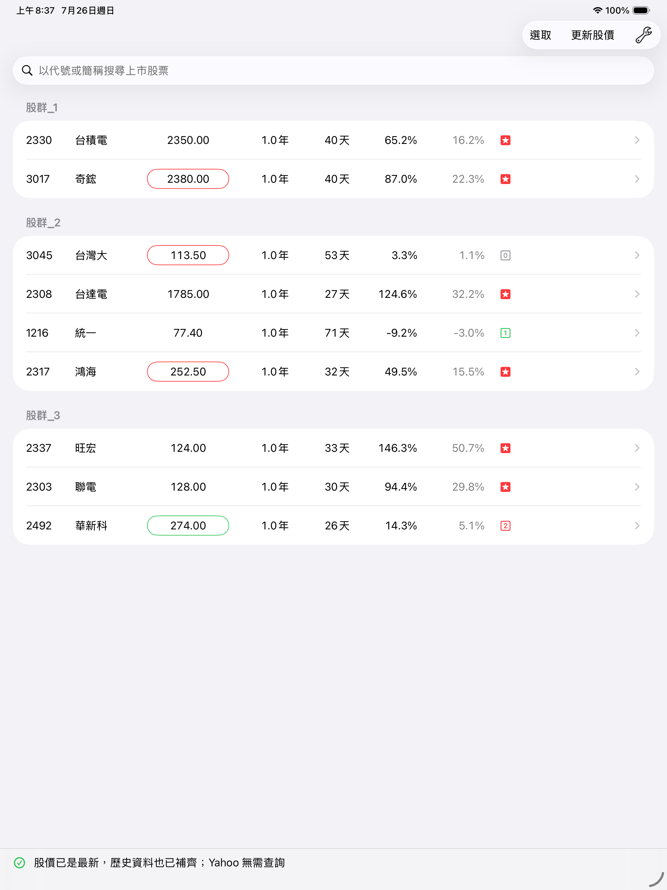
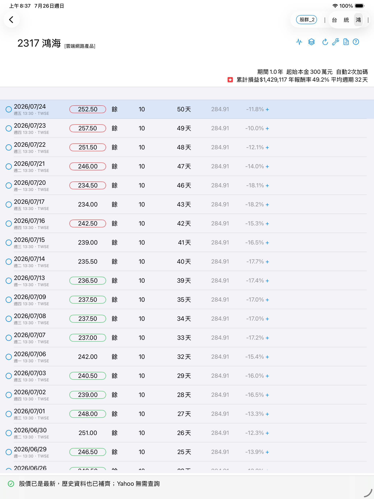
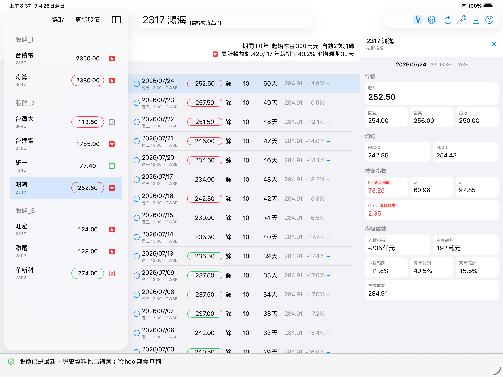

# simStock3 小確幸股票模擬機

小確幸是以台灣上市股票為範圍的個股模擬工具。App 下載歷史交易資料、計算技術指標，依既定規則模擬買賣，並以[報酬率](doc/報酬率.md)與[持股週期](doc/週期.md)協助評估股票。

它不是券商下單工具，也不預測新聞或公司基本面；盤中行情只用來更新當日模擬結果與買賣建議。

## 目前版本

- v3.1.1 (10)（僅支援 iPad，需 iPadOS 26 以上）
- 已登記 UDID 的開發裝置，可由 [小確幸網站](https://peiyu66.github.io/simStock3/) 開啟安裝連結。
- 直接安裝：[下載 latest 版本](itms-services://?action=download-manifest&url=https%3A%2F%2Fgithub.com%2Fpeiyu66%2FsimStock3%2Freleases%2Fdownload%2Flatest%2Fmanifest.plist)
- 安裝資格與限制請參閱[加入小確幸](doc/加入小確幸.md)。

介面以 13 吋 iPad 為主要設計與驗證目標，並已在約 10 吋的 iPad 橫直式版面完成驗證。較小尺寸的 iPad 雖可安裝，但部分多欄資訊可能需要縮減。

## 主要功能

- 搜尋上市股票，組成多個股群。
- 自動補齊歷史日交易，並在啟動或回到前景時檢查最新股價。
- 盤中使用 Yahoo 行情；收盤資料完成後以 TWSE 日資料為準。
- 計算均線、KD、OSC、價格與成交量統計值。
- 依既定的追高（H）與承低（L）規則模擬買進、賣出及加碼。
- 顯示累計損益、[實年報酬率](doc/報酬率.md#實年報酬率)、[真年報酬率](doc/報酬率.md#真年報酬率)及[平均持股週期](doc/週期.md)。
- 保留手動反轉買賣、手動加碼及模擬設定，方便比較不同交易時機。
- 提供更新診斷，協助分辨網路、來源資料與解析異常。

## iPad 版面

- 直式：股群清單與個股交易頁分開顯示。
- 橫式：同時顯示股群、個股交易；13 吋 iPad 可再開啟技術檢視成為三欄。
- 建議使用約 10 吋以上的 iPad，以完整呈現橫式多欄資訊。
- 選取某個交易日後，技術檢視、股票切換與裝置旋轉會保留該日期；也可一鍵回到最新一筆。

## 策略要求

小確幸採用純技術面的短期模擬策略：

1. 低買高賣賺取價差，不考慮股息、股利。
2. 在縮短買賣[週期](doc/週期.md)與提升[報酬率](doc/報酬率.md)之間取得平衡。
3. 以保本、小賺及維持現金流為目標，不追求偶爾大賺。
4. 規則應簡單、容易實現，也能由長期回測評估。

這裡的「短期」是指每輪買賣的持股週期；投入策略的觀察期間仍應至少涵蓋兩年。

追高、承低規則的代號、回測方法、既有實驗與採用決策，請參閱[回測規則驗證](doc/回測規則驗證.md)。

## 買賣規則

1. 每次首次買進只使用該股預算的一部分，其餘保留作為加碼備用金。
2. 買進數量以「起始本金」當時可買到的整張數量計算。
3. 賣出時一次結清該輪持股。
4. 預設最多自動加碼兩次；仍可依個股或股群調整模擬設定。

## 選股原則

1. 熱門股通常優於傳統股，但應以不同類型股票共同檢驗規則。
2. 近三年模擬的平均[實年報酬率](doc/報酬率.md#實年報酬率)達 20% 以上、平均週期在 65 天以內者，標示為[紅星股](doc/選股評等.md)。
3. 評等來自歷史模擬，只適合作為選股參考，不代表未來績效。

## 基本操作

1. 在直式股群畫面使用搜尋列，勾選一支或多支上市股票並加入股群。
2. App 會依股票的模擬起始日補齊歷史資料，完成技術值與模擬計算。
3. 點選股票查看每日交易、庫存、成本、報酬率與買賣提示。
4. 在個股頁開啟技術檢視，可檢查所選日期的行情、均線、指標與該輪績效。

右上角「？」的「參考訊息」會分別顯示 App 版本／Build 與 `Tn/Sn` 規則版本。兩者的意義及何時會完整重算資料，請參閱[版本與資料重算](doc/版本與資料重算.md)。

## Q&A

### 小確幸有在 App Store 上架嗎？

沒有。目前以開發測試及 Ad Hoc 方式分享，只能安裝在已登記的裝置。

### 有些股票為什麼找不到？

- 目前只提供台灣上市股票，不含上櫃股票。
- 已在股群內的股票不會重複列入可加入的搜尋結果；輸入完整代號或名稱時，App 會提示它所在的股群。

### 小確幸會自動下單嗎？

不會。小確幸只依歷史與盤中資料模擬買賣並顯示建議；是否透過券商下單，完全由使用者自行決定。

日期左側的圓形按鈕及右側的加碼提示，可用來改變模擬買賣時機並觀察後續結果。

### 模擬結果準確嗎？

回測不是預測。小確幸的目標也不是準確買在最低、賣在最高，而是用一致規則比較長期報酬與週期。歷史價格、網路來源、公司行為及模擬假設都可能造成誤差。

> 小確幸使用 TWSE 與 Yahoo 行情資料，僅供個人模擬與技術研究；資料可能延遲、錯誤或中斷，不保證正確或即時，亦不對任何投資決策或損益負責。

## 其他說明

- [界限](doc/界限.md)
- [選股評等](doc/選股評等.md)
- [報酬率](doc/報酬率.md)
- [週期](doc/週期.md)
- [使用小確幸的參考觀點](doc/使用小確幸的參考觀點.md)
- [版本與資料重算](doc/版本與資料重算.md)
- [回測規則驗證](doc/回測規則驗證.md)

## 畫面

以下截自 iPad Pro 13-inch（M5）Simulator，iPadOS 26.5，simStock3 v3.0（4）。

### 直式：股群與個股交易

  
  

### 橫式：股群、交易與技術檢視

