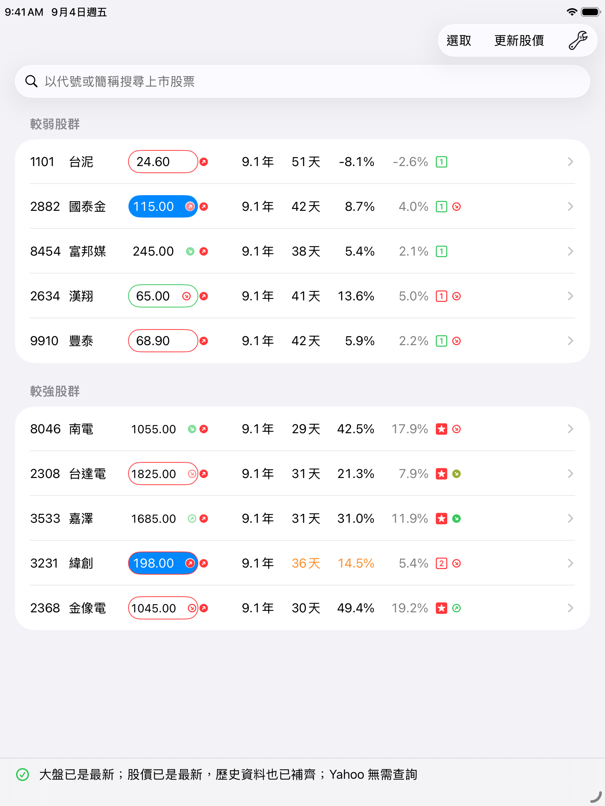
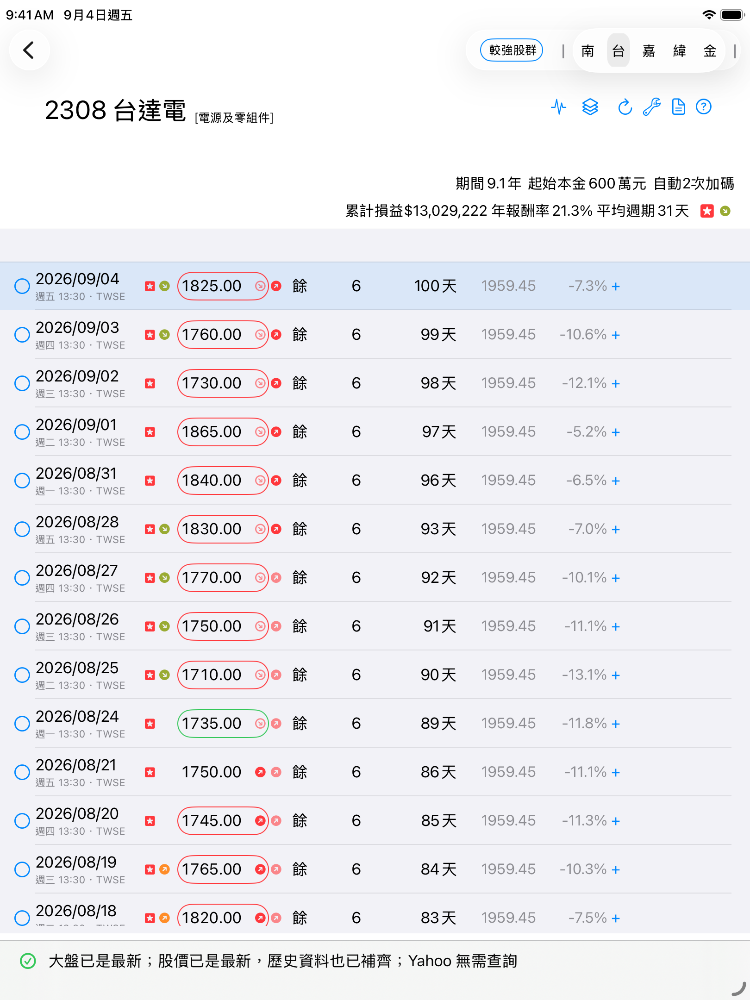
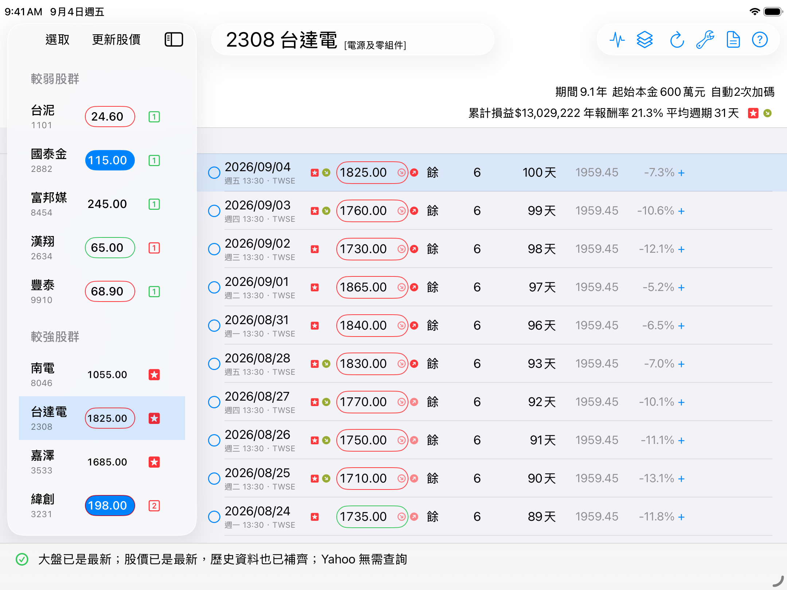
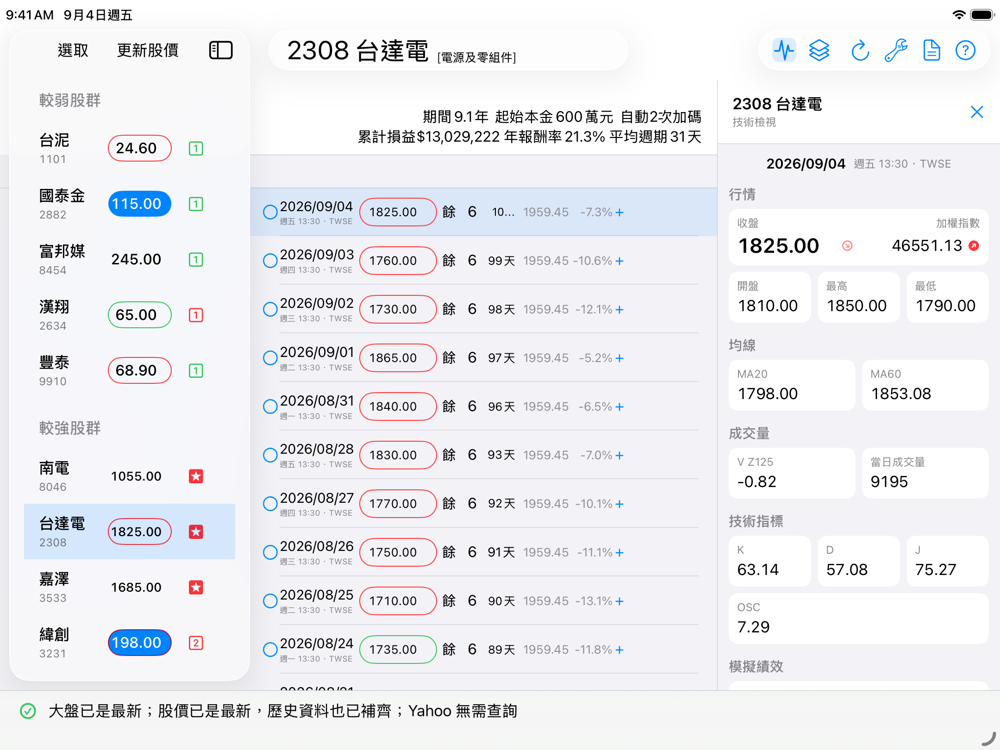

# simStock3 小確幸股票模擬機

[GitHub 專案](https://github.com/peiyu66/simStock3)

小確幸是台灣上市股票的個人模擬工具。它依歷史與盤中行情模擬買賣，協助比較報酬、持股時間與資金運用。

它不會自動下單，也不預測新聞、公司基本面或未來股價。

## 安裝

- 僅支援 iPad，需 iPadOS 26 以上。
- 已登記的 iPad 可由[小確幸網站](https://peiyu66.github.io/simStock3/)安裝，或直接[下載最新版本](itms-services://?action=download-manifest&url=https%3A%2F%2Fgithub.com%2Fpeiyu66%2FsimStock3%2Freleases%2Fdownload%2Flatest%2Fmanifest.plist)。
- 安裝資格與限制見[加入小確幸](doc/加入小確幸.md)。

介面以 13 吋 iPad 為主要設計基準，並已驗證約 10 吋 iPad 的橫式與直式版面。

## 可以做什麼

- 搜尋上市股票並組成股群，自動補齊歷史行情。
- 依固定規則模擬買進、賣出與加碼，也可保留手動調整。
- 顯示累計損益、[實年報酬率](doc/報酬率.md#實年報酬率)、[真年報酬率](doc/報酬率.md#真年報酬率)及[平均持股週期](doc/週期.md)。
- 顯示 MA20、MA60、K、D、J、OSC 等技術數值、選股評等，以及個股、大盤與評等三種趨勢。
- 提供更新狀態與診斷，協助辨識資料來源或網路異常。

## 看懂畫面

| 趨勢圖示 | 顯示位置 | 意義 |
|---|---|---|
| 個股價格趨勢 | 成交價右側 | 個股目前位於探頂、拉回、探底或反彈的前期／後期 |
| 加權指數趨勢 | 成交價泡泡外側或「加權指數」旁 | 同一交易日的大盤價格階段；盤中沒有同日正式資料時留空 |
| 評等趨勢 | 選股評等右側 | 小確幸策略對該股的近期效率正在改善或惡化 |

選股評等依序顯示為紅底白星、紅框「2」、紅框「1」、灰框「0」、綠框「1」、綠框「2」、綠框「3」。完整評等、灰色狀態及趨勢分段見[選股評等](doc/選股評等.md)。

盤中只暫時更新個股，大盤須等收盤後取得正式日資料。完整更新時間見[歷史價格下載](doc/週期.md#歷史價格下載)；同日大盤只供畫面對照，買賣規則只會使用決策日前最近一個完整市場交易日。

直式會分開顯示股群與個股頁；橫式可並列股群、每日交易紀錄及技術檢視。較窄的畫面會省略部分摘要圖示，但不刪除資料。

## 基本使用

1. 在直式股群畫面搜尋一支或多支上市股票並加入股群。
2. 等待歷史行情、技術數值與模擬結果完成更新。
3. 點選股票，查看每日交易、庫存、成本、報酬率與買賣提示。
4. 開啟技術檢視，查看所選日期的行情、指標、大盤與該輪績效。

右上角「？」會顯示小確幸版本與規則版本；更新後是否需要重算，見[版本與資料重算](doc/版本與資料重算.md)。

## 使用原則

小確幸以技術面、價差與較短持股週期為主，不計股息、股利、增減資。首次買進只使用部分預算，其餘資金留給後續加碼；詳細資金安排見[使用小確幸的參考觀點](doc/使用小確幸的參考觀點.md)。

選股評等與箭頭都來自歷史模擬，只供比較與提醒，不代表未來績效。正式買賣與加碼條件見[現行回測規則](doc/現行回測規則.md)。

## 常見問題

### 為什麼找不到某些股票？

目前只提供台灣上市股票，不含上櫃股票。已在股群內的股票也不會重複出現在加入清單。

### 小確幸會自動下單嗎？

不會。畫面只顯示模擬結果與建議，是否透過券商下單完全由使用者決定。

### 可以改變模擬買賣時間嗎？

可以。日期左側的圓形按鈕及右側的加碼提示可用來調整，後續結果會重新計算。

### 模擬結果準確嗎？

回測不是預測。歷史價格、資料來源、公司行為及模擬假設都可能造成誤差。

> 小確幸使用 TWSE 與 Yahoo 行情資料，僅供個人模擬與技術研究；資料可能延遲、錯誤或中斷，不保證正確或即時，亦不對任何投資決策或損益負責。

## 使用說明

- [選股評等與三種趨勢圖示](doc/選股評等.md)
- [報酬率](doc/報酬率.md)
- [週期與行情更新時間](doc/週期.md)
- [使用小確幸的參考觀點](doc/使用小確幸的參考觀點.md)
- [版本與資料重算](doc/版本與資料重算.md)
- [使用範圍與限制](doc/界限.md)
- [安裝資格與限制](doc/加入小確幸.md)

## 研究及開發資料

- [現行回測規則](doc/現行回測規則.md)
- [回測規則驗證](doc/回測規則驗證.md)
- [完整文件索引](doc/README.md)

## 畫面

以下截自 `simStock3 iPad 10.2-inch`（iPad 第 9 代）九年模擬裝置，iPadOS 26.5。畫面只用來說明版面，不是選股推薦，也不代表未來績效。

### 直式：股群與個股交易

  
  

### 橫式：股群、交易與技術檢視

一般交易畫面：

開啟技術檢視：

