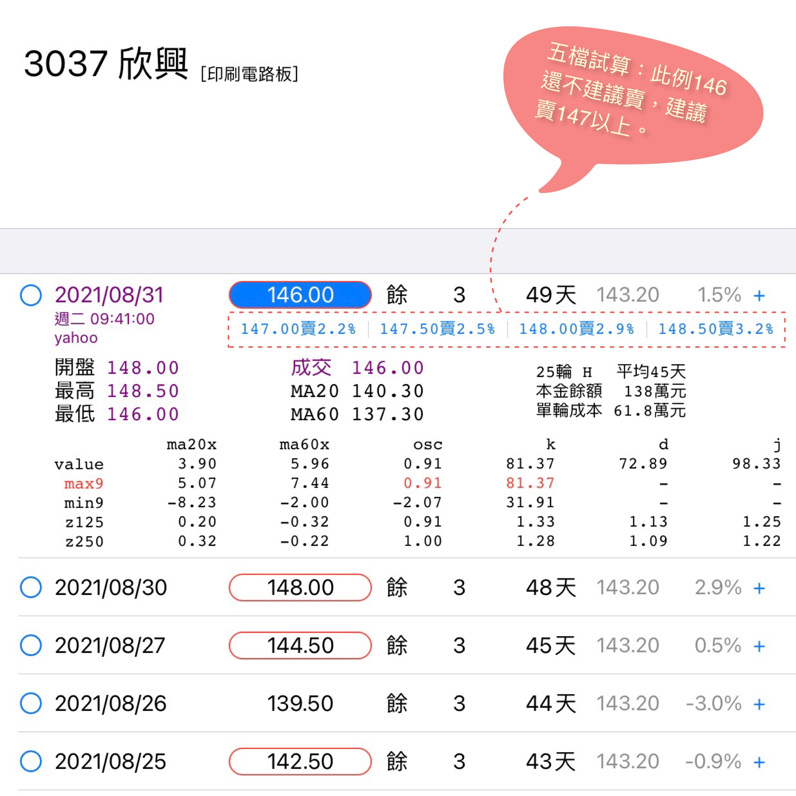
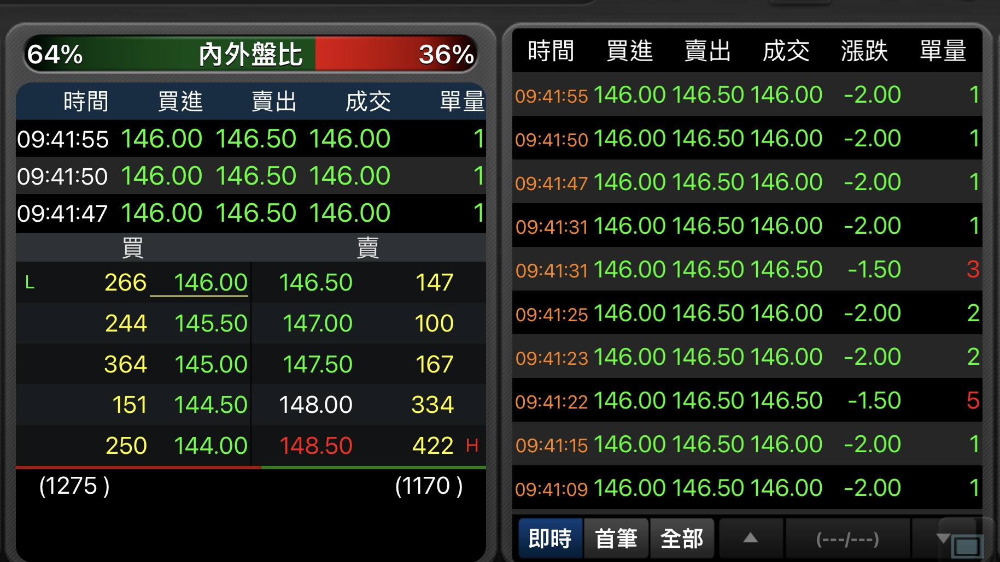

# 五檔及內外盤

小確幸不是即時的程式交易，只能模擬買賣。而我們很難準確的以收盤價完美地執行模擬所提示的買賣。所以我想試試做一些人為的努力。

盤中當時，小確幸的模擬提示了五檔買賣試算，即已列出五檔之內模擬「可買的價位和張數」、或是「可賣的價位和報酬率」。  
  

    
此時應即考慮內外盤比及五檔現況掛單。

內盤綠較多主跌，外盤紅較多主漲，其差值可視為今日漲跌趨勢的強弱程度。但是內外盤作用的時間很短，隨時都能變盤，只宜作為掛單當下的參考，而不能預測收盤趨勢。  

## 掛單的時間是以慢買急賣為原則

買單在12點半之後再掛，賣單於開盤之初即時掛。這是為了減低對自己的心理負擔。

若不幸買高了賣低了，其實只對當日的心情有影響。

應知這一點誤差，實在不能影響到年度損益，而且比猶豫而錯失成交機會好太多了。
