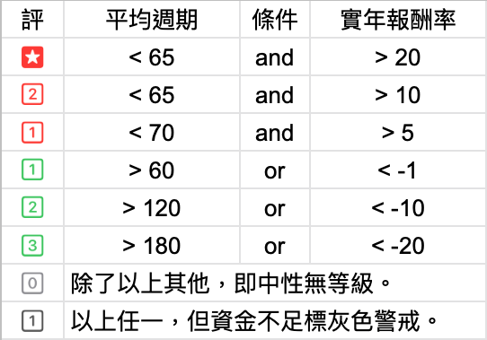

# 選股評等

根據平均「週期」（天數）和「實年報酬率」劃分的評等，代表該股的熱門程度，以之作為小確幸選股參考。

紅色星星即是小確幸根據模擬結果所推薦的熱門股。

「資金不足」的警示是指，模擬期間內，曾發生「起始本金」不足以買到該股至少1張股票，以致模擬結果可能失真，則所得評等自也可能誤差。

## 如何選股？

三年模擬而得紅星，再縮短為兩年模擬，若仍是紅星，再確認近半年的技術線圖沒有明顯持續下滑的趨勢即好。

如此，該股就可納入等候執行買賣的股群。
